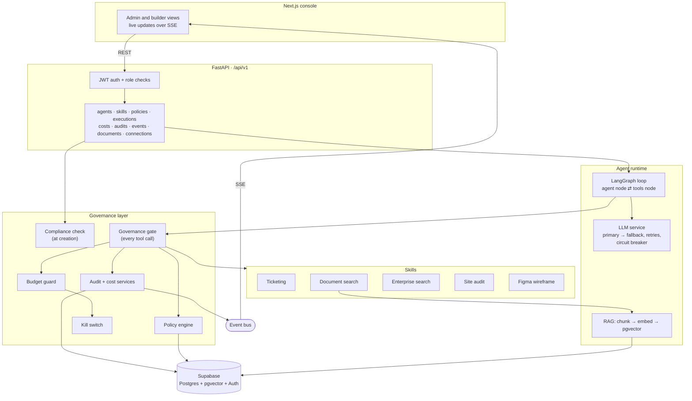

# GovernAI

**Build agents fast. Govern them faster.**

GovernAI is a platform for building internal AI agents from reusable **skills**, where every agent gets an identity (an **Agent Passport**), a **scoped permission set** and an **enforced live cost budget** the moment it is created. Governance is generated at creation time, not bolted on afterwards.

> Deloitte Capstone Program 2026 · Manipal University Jaipur · **Team Fennec**

---

## Table of contents
- [The problem](#the-problem)
- [What GovernAI does](#what-governai-does)
- [How governance works](#how-governance-works)
- [Architecture](#architecture)
- [Tech stack](#tech-stack)
- [Skills](#skills)
- [Getting started](#getting-started)
- [Configuration](#configuration)
- [API overview](#api-overview)
- [Testing](#testing)
- [Repository structure](#repository-structure)
- [Documentation](#documentation)
- [Known limitations and roadmap](#known-limitations-and-roadmap)
- [Team](#team)
- [License](#license)

---

## The problem

Enterprises are deploying AI agents faster than they can govern them:

- **Duplicated effort:** every team rebuilds the same connectors (ticketing, document search, enterprise search).
- **Unmonitored access:** agents reach internal data with no consistent identity or permission model.
- **No cost control:** nobody can answer *"how much are we spending on agents?"* or *"can we stop this one right now?"*

The result is compliance risk, budget overruns and wasted engineering time.

## What GovernAI does

| Capability | What it means |
|---|---|
| **Skill library** | Agents are assembled from shared, reusable skills instead of hand-written integrations. |
| **Agent Passport** | Every agent gets an identity, one owner and a lifecycle state (`DRAFT → APPROVED → ACTIVE ⇄ SUSPENDED`). |
| **Least-privilege permissions** | An agent holds exactly the permissions its skills declare, never its creator's. |
| **Compliance at creation** | A deterministic 4-rule check runs before activation and lists every violation. |
| **Fail-closed policy gate** | Every tool call passes a gate that checks budget, lifecycle, permission and admin policies. Any error means deny. |
| **Live cost budget (headline feature)** | Real token cost is recorded per LLM call. A rolling 24-hour cap is checked before every LLM call and every tool call, and the agent is **suspended automatically** when it is exceeded. |
| **Kill switch** | An admin can suspend any agent; the very next call is denied. |
| **Append-only audit log** | Every allowed **and** denied action is recorded and streamed live to the console. |
| **Human in the loop** | Ticket replies are drafted by the agent and approved or escalated by a person before anything is posted. |
| **Real-time console** | Live dashboard of agents, runs, tool calls, policy decisions and spend (Server-Sent Events). |

## How governance works

The language model only ever *asks* for a tool call. The platform decides whether it runs.

```
LLM asks for a tool
      │
      ▼
govern_tool()  ── the single gate every tool call passes (domain/governance/middleware.py)
  1. Budget     spend in the last 24h below the cap?        no → deny + suspend agent
  2. Passport   agent exists and is ACTIVE?                 no → deny
  3. Permission passport holds the tool's permission?       no → deny
  4. Policies   admin rules (deny list, rate limit, …)      match → deny
  5. Execute    run the tool with a 30-second timeout
  6. Audit      record ALLOW or DENY, publish a live event
      │
      ▼
Result (or a structured "denied" message) goes back to the LLM
```

The budget is also checked **before every LLM call**, because the model call is the largest cost. A model with no price in the pricing table suspends the agent rather than silently counting as free.

**Policy rule types enforced by the engine**

| Rule type | Config | Denies when |
|---|---|---|
| `DENY_LIST` | `blocked_tools`, `blocked_args` | a blocked tool is called, optionally only with a blocked word in its arguments |
| `RATE_LIMIT` | `max_calls_per_minute` | the agent has made that many tool calls in the last minute (counted from the audit log) |
| `solr_query_blocklist` | `keywords` | an enterprise-search query contains a blocked keyword |
| `brand_color_check` | `allowed_hex_codes` | a generated wireframe uses a colour outside the approved palette |

Rules are database rows, read on every evaluation, so enabling or disabling one takes effect on the next call without a redeploy.

## Architecture



**Backend layering:** `api/v1` routers → `api/schemas` (Pydantic) → `domain/*/service.py` → `domain/*/repository.py` → `domain/*/models.py` (SQLAlchemy). Runs are started with `POST /executions` (returns **202**) and executed in a background task, while the console watches `GET /executions/{id}/stream`.

## Tech stack

| Layer | Technology |
|---|---|
| Frontend | Next.js 16 (App Router), React 19, TypeScript, Tailwind CSS v4, Motion, `@supabase/ssr` |
| Backend | Python 3.10+, FastAPI, SQLAlchemy 2 (async) + asyncpg, Alembic, Pydantic v2, structlog |
| Agent runtime | LangGraph |
| LLMs | Groq (`openai/gpt-oss-20b`) primary, Google Gemini (`gemini-3.6-flash`) fallback, with retries and a circuit breaker |
| Embeddings / RAG | Gemini `gemini-embedding-001` + pgvector |
| Database, vectors, auth | Supabase (Postgres + pgvector + GoTrue) |
| Live updates | Server-Sent Events over an in-process event bus |
| Tooling | uv, pytest + pytest-asyncio, ruff, pyright, ESLint |

## Skills

| Skill | Tools | Permissions | Backed by |
|---|---|---|---|
| **Ticketing** | `read_ticket`, `search_tickets`, `draft_ticket_reply` | `ticket:read`, `ticket:create` | Jira when credentials are configured, otherwise an in-memory mock adapter |
| **Document search (RAG)** | `search_documents`, `get_document` | `docs:search:<scope>` | Uploaded documents → chunked → Gemini embeddings → pgvector, filtered by access scope inside the SQL query |
| **Enterprise search** | `search_solr`, `facet_solr` | `solr:search:<collection>` | A Solr-style search adapter over a seeded in-app index (`knowledge_base`, `compliance_docs`) |
| **Site audit** | `audit_website`, `crawl_website` | `site:audit:run`, `site:crawl:run` | Google PageSpeed Insights (Lighthouse) and a native crawler |
| **Figma design** | `generate_wireframe` and a read tool | `figma:design:generate`, `figma:design:read` | An offline wireframe engine by default (SVG + node tree); the Figma API when a token is configured |

Every tool declares a `required_permission`, and an agent's passport receives the union of its skills' permissions at creation.

## Getting started

### Prerequisites
- **Python 3.10+** and [**uv**](https://docs.astral.sh/uv/)
- **Node.js 20+** and npm
- A **Supabase** project (Postgres + pgvector + Auth), **or** Docker for a local Postgres with pgvector
- API keys for **Groq** and/or **Gemini** (both have free tiers). Without any key the backend falls back to a mock LLM.

### 1. Clone
```bash
git clone https://github.com/bakshishantanu/GovernAI.git
cd GovernAI
```

### 2. Database
Use your Supabase connection string in `DATABASE_URL`, or start a local Postgres with pgvector:
```bash
docker compose up -d
```

### 3. Backend
```bash
cd backend
cp .env.example .env
```
Fill in `.env` (see [Configuration](#configuration)), then:
```bash
uv sync
uv run alembic upgrade head
uv run python scripts/seed_demo_data.py
uv run uvicorn app.main:app --reload --port 8000
```
The API is now at `http://localhost:8000`, with interactive docs at `http://localhost:8000/docs` and a health check at `/health`.

Optional helpers in `backend/scripts/`:
- `promote_to_admin.py <user_uuid>`: give a signed-in user the admin role
- `ingest_documents.py`: load documents for the document-search skill

### 4. Frontend
```bash
cd frontend
cp .env.example .env.local
npm install
npm run dev
```
Open `http://localhost:3000`.

> **Local development without Supabase Auth:** set `AUTH_ALLOW_DEV_TOKEN=true` in `backend/.env` and leave the Supabase variables empty in `frontend/.env.local`. The console then uses a development token. **Never enable this anywhere reachable from the internet.**

## Configuration

### Backend (`backend/.env`)
| Variable | Purpose |
|---|---|
| `DATABASE_URL` | Postgres connection string (`postgresql+asyncpg://…`) |
| `SUPABASE_URL`, `SUPABASE_ANON_KEY` | Supabase project; `SUPABASE_URL` is also used to fetch JWKS signing keys |
| `SUPABASE_JWT_SECRET` | Fallback HS256 JWT secret. Without any verification key configured, logins are refused (503) rather than accepted |
| `ADMIN_EMAILS` | Comma-separated emails that get the admin role |
| `GROQ_API_KEY`, `GEMINI_API_KEY` | LLM providers |
| `LLM_PRIMARY_MODEL`, `LLM_FALLBACK_MODEL`, `OCR_MODEL` | Model names |
| `AGENT_BUDGET_USD_24H` | Budget cap per agent over a rolling 24h window (default `5.00`) |
| `JIRA_BASE_URL`, `JIRA_EMAIL`, `JIRA_API_TOKEN`, `JIRA_PROJECT_KEY` | Jira for the ticketing skill; leave blank to use the mock adapter |
| `JIRA_WEBHOOK_SECRET` | Shared secret for the Jira webhook receiver |
| `CONNECTIONS_ENCRYPTION_KEY` | Fernet key for stored integration credentials. **Must be set in any real deployment** |
| `AUTH_ALLOW_DEV_TOKEN` | Local development token bypass. Off by default |
| `CORS_ORIGINS` | Allowed console origins (default `http://localhost:3000`) |

### Frontend (`frontend/.env.local`)
| Variable | Purpose |
|---|---|
| `NEXT_PUBLIC_SUPABASE_URL`, `NEXT_PUBLIC_SUPABASE_ANON_KEY` | Supabase Auth for sign-in |
| `NEXT_PUBLIC_API_URL` | Backend base URL (default `http://localhost:8000/api/v1`) |
| `REQUIRE_AUTH` | `true` to redirect signed-out visitors to `/login` |

`.env` files are gitignored. Never commit real keys.

## API overview

All routes are under `/api/v1` and require a bearer token, except `GET /health`.

| Area | Endpoints |
|---|---|
| Auth | `GET /auth/me`, `GET /auth/settings` |
| Agents | `POST /agents`, `GET /agents`, `GET /agents/{id}`, `PATCH /agents/{id}/submit`, `PATCH /agents/{id}/activate`, `DELETE /agents/{id}`, `POST /agents/{id}/kill` (admin), `POST /agents/{id}/reactivate` (admin) |
| Skills | `GET /skills`, `GET /skills/{id}` |
| Policies | `GET/POST /policies`, `GET/PATCH/DELETE /policies/{id}`, `GET/POST /policies/{id}/rules`, `PATCH /policies/{id}/rules/{rule_id}` (writes are admin only) |
| Executions | `POST /executions` (202), `GET /executions`, `GET /executions/{id}`, `GET /executions/{id}/timeline`, `POST /executions/{id}/cancel`, `GET /executions/{id}/stream` (SSE) |
| Costs | `GET /costs`, `GET /costs/summary`, `GET /costs/budget` |
| Audit | `GET /audits` |
| Live feed | `GET /events/stream` (SSE, scoped by role) |
| Documents | `POST /documents` (202), `GET /documents`, `GET /documents/{id}`, `DELETE /documents/{id}` |
| Connections | `GET /connections`, `PUT /connections/{key}`, `DELETE /connections/{key}` |
| Ticket drafts | `GET /ticket-drafts`, `POST /ticket-drafts/{id}/approve`, `POST /ticket-drafts/{id}/escalate` |
| Webhooks | `POST /webhooks/jira` (shared secret) |

Full, interactive documentation is generated by FastAPI at `/docs`.

## Testing

```bash
# backend
cd backend
uv run pytest
uv run ruff check app tests

# frontend
cd frontend
npx tsc --noEmit
npm run build
```

The backend test suite mirrors the source tree under `backend/tests/` and covers the policy engine, every rule type, the budget guard, the governance gate, compliance rules, the kill switch, audit wiring, cost pricing and the skills.

## Repository structure

```
.
├── backend/
│   ├── app/
│   │   ├── api/             # routers (v1), Pydantic schemas, SSE helpers, run executor
│   │   ├── domain/          # agents, auth, audit, costs, documents, executions, governance,
│   │   │                    # permissions, policies, skills, connections, ticket_drafts
│   │   ├── runtime/         # LangGraph agent loop, LLM providers, RAG, skill adapters
│   │   ├── skills/          # ticketing, document search, enterprise search, site audit, figma
│   │   └── infrastructure/  # database session, event bus
│   ├── alembic/             # database migrations
│   ├── scripts/             # seed data, admin promotion, document ingestion
│   └── tests/
├── frontend/
│   └── src/
│       ├── app/             # [role]/ console (admin and builder), login, landing
│       ├── components/
│       └── lib/             # API client, SSE client, auth helpers
├── docs/adr/                # architecture decision records
├── specs/                   # Spec-Kit feature specifications
├── PRD.md · SRS.md · FRD.md # product, system and functional requirements
└── docker-compose.yml       # local Postgres + pgvector
```

## Documentation

| Document | Contents |
|---|---|
| [`PRD.md`](PRD.md) | Problem, personas, USP, goals, scope |
| [`SRS.md`](SRS.md) | Functional and non-functional requirements |
| [`FRD.md`](FRD.md) | Feature-level flows and acceptance criteria |
| [`docs/adr/`](docs/adr/) | Architecture decisions: Supabase over Neon, governance middleware design, Supabase authentication, RBAC permission model |
| [`.specify/memory/constitution.md`](.specify/memory/constitution.md) | The seven engineering principles (governance-gated execution, least privilege, fail-closed, …) |

## Known limitations and roadmap

This is an MVP. Known limits, and what comes next:

- **Single backend instance:** the event bus and circuit breaker are in memory. Next: Redis pub/sub and a job queue for runs.
- **One budget cap for all agents:** configured by `AGENT_BUDGET_USD_24H`. Next: a per-agent budget.
- **Tenant isolation is enforced in application queries** by `org_id`. Next: Postgres row-level security policies.
- **The audit log is append-only by application design.** Next: database-level write protection and tamper evidence.
- **No CI pipeline yet.** Next: lint, type-check, tests and secret scanning on every pull request.
- **Not yet built:** PII redaction before prompts, SSO, skill versioning, and a skill marketplace for uploading community skills.

## Team

**Team Fennec**: Deloitte Capstone Program 2026, Manipal University Jaipur

| Member | Area |
|---|---|
| **Pranav Ladha** | Authentication, API routes, governance middleware, frontend, CI/CD |
| **Priya Agrawal** | LLM integration, LangGraph runtime, skills, RAG |
| **Shantanu Bakshi** | Database schema, models and repositories, policy engine, event bus |

## License

Released under the [MIT License](LICENSE).
